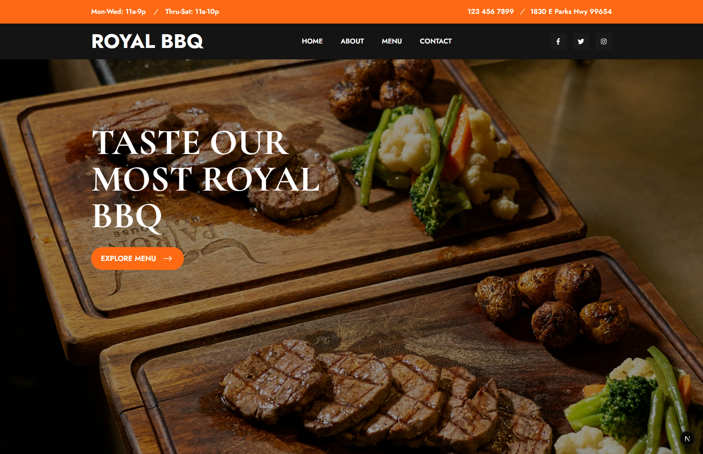

# Project Title

This repository serves as a production-ready frontend template. It focuses on delivering a flawless user experience (UX) and clean code architecture, allowing developers or restaurant owners to easily plug in their own backend, CMS, or database.

## 🚀 Features

**Dynamic Menu Display**: Showcases premium dishes with images, prices, and star ratings (e.g., BBQ Burgers, Brisket Sandwiches, Tri-Tip).

**Fully Responsive UI**: Optimized for a seamless experience across mobile, tablet, and desktop viewports.

**Modern Design Aesthetic**: Features high-quality hero imagery, clean typography, dynamic call-to-action buttons, and curated testimonials.

**Location & Hours Integration**: Clearly structured contact information, operational hours, and an accessible layout for seamless user communication.

## 🛠️ Tech Stack
Frontend: Next.js (App Router), React, Tailwind CSS, Next-Video, Motion

Styling: Modern CSS / Tailwind for responsive layouts and dark-mode aesthetics

Tooling: Turbopack / Webpack compiler configurations

